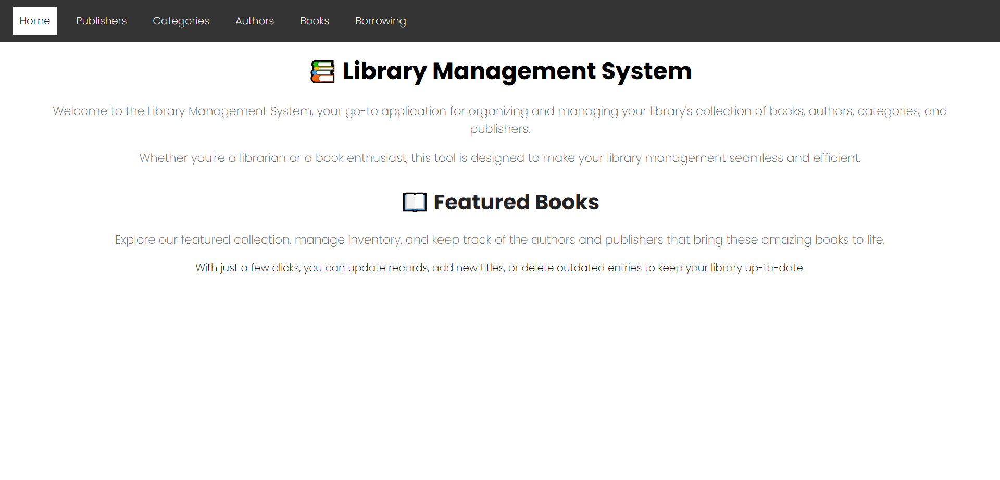
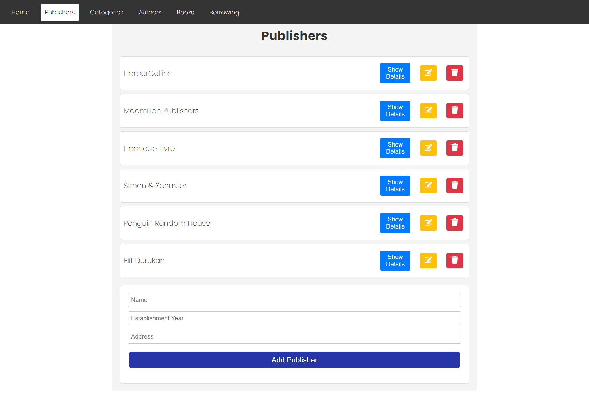
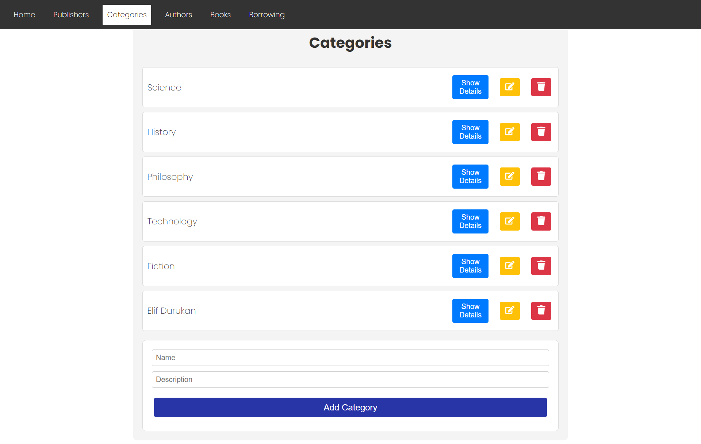
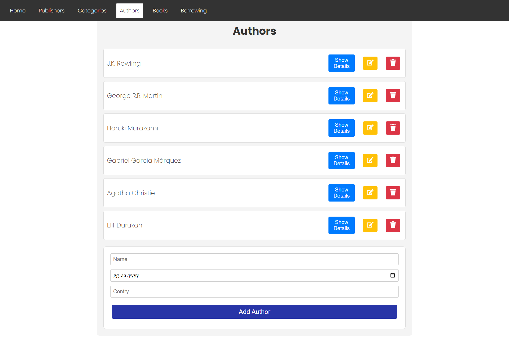
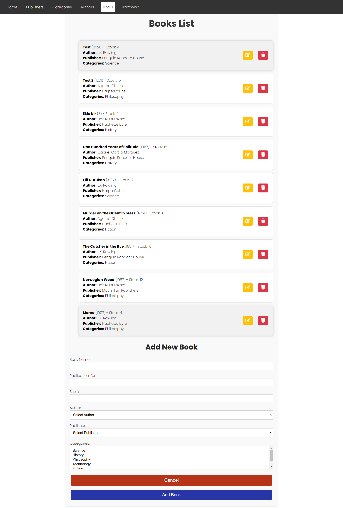

# 📚 Capstone Project: Library Management System

##  📝 Project Overview

Welcome to the **Library Management System** project! This project is a **Single Page Application (SPA)** developed using **React** and **React Router**. The application allows users to efficiently manage books, authors, categories, and publishers through a fully functional CRUD (Create, Read, Update, Delete) interface.

###  📄 Key Features

This application includes the following pages:
- **Home Page (Welcome Page)**
- **Publisher Page**
- **Category Page**
- **Book Page**
- **Author Page**
- **Borrowing Page**

Each page includes full CRUD operations, allowing users to create, view, edit, and delete entries related to publishers, categories, books, authors, and borrowing.

### 📝 CRUD Operations

The application supports the following operations:
- **Create:** Add new entries for publishers, categories, books, authors, and borrowing records.
- **Read:** View details of existing entries for publishers, categories, books, authors, and borrowing records.
- **Update:** Edit existing entries to modify their details.
- **Delete:** Remove entries from the system when necessary.

If a CRUD operation fails, the user will be notified with an appropriate message.

## ⭐ Design

For the design of this application, I used **CSS** to provide a clean, responsive, and user-friendly interface. The layout is simple yet functional, with a focus on usability and accessibility.

### ⚙️ Technologies Used

This project incorporates the following technologies:
- **Frontend:** React, React Router
- **Backend:** Configured backend (CRUD operations connected to the database)
- **HTTP Requests:** Axios (or any other HTTP client of your choice)

## API Documentation

The backend API can be accessed and tested via **Swagger**. This allows you to interact with the API endpoints and perform CRUD operations directly from the documentation interface. You can fetch and manage data from the backend using **Axios**, or any other HTTP client library you prefer.

### API Endpoints

- **GET** `/publishers` - Retrieve the list of publishers.
- **POST** `/publishers` - Add a new publisher.
- **PUT** `/publishers/{id}` - Update an existing publisher.
- **DELETE** `/publishers/{id}` - Delete a publisher.

The same set of endpoints is available for managing **categories**, **books**, **authors**, and **borrowing**.

## 📸 Screenshots








## 🚀 Project Setup

To get the project up and running locally, follow these steps:

### 🔧 Prerequisites

Ensure that you have **Node.js** and **npm** installed on your system.

### Steps to Run Locally

1. Clone the repository:
   ```bash
   git clone <https://github.com/elfdrkn/LibraryApp>
2. Navigate into the project directory:
    cd <project-directory>
3. Install the required dependencies:
    npm install
4. Start the development server:
    npm start
5. Open your browser and go to http://localhost:3000 to view the app.

### Backend Integration
The backend is pre-configured and ready to handle the required CRUD operations. You can interact with the backend using Axios or any other HTTP client of your choice.

Live Demo
You can view the live version of this project by visiting the following link: [Live Demo](https://library-app-liard.vercel.app/)

Conclusion
This project showcases a fully functional library management system with React. It provides an interactive interface to manage and organize books, authors, categories, and publishers. The integration with a backend API allows seamless CRUD operations, making this a complete and efficient web application.

Thank you for reviewing my project!
